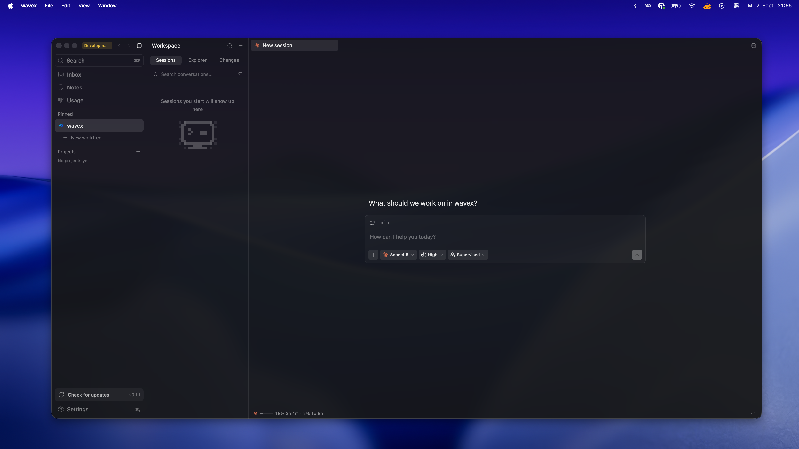

<div align="center">


# wavex

**One desktop app for every coding agent you already pay for.**

[](LICENSE)
[](#install)
[](#build-from-source)

</div>



---

wavex drives the agent CLIs installed on your machine through your own
subscriptions. Tabs are sessions, the composer is the input, and the agent works
in your real checkout — not a sandbox copy. wavex does not resell tokens and has
no account of its own.

## Providers

Install and sign in to at least one. wavex detects what is on your PATH and
offers only that.

| Provider                                              | Sign in                                                             |
| ----------------------------------------------------- | ------------------------------------------------------------------- |
| [Claude Code](https://claude.com/product/claude-code) | `claude auth login`                                                 |
| [Codex](https://developers.openai.com/codex/cli)      | `codex login`                                                       |
| [Cursor CLI](https://cursor.com/cli)                  | `agent login`                                                       |
| [Grok Build](https://docs.x.ai/build/overview)        | `curl -fsSL https://x.ai/cli/install.sh \| bash`, then `grok login` |
| [OpenCode](https://opencode.ai)                       | `opencode auth login`                                               |
| [Pi](https://pi.dev/)                                 | `pnpm add -g @earendil-works/pi-coding-agent`                       |
| [omp](https://omp.sh)                                 | `curl -fsSL https://omp.sh/install \| sh`                           |
| [fx](https://fx.sh)                                   | `curl -fsSL https://fx.sh/setup.sh \| bash`, then `fx login`        |

Switch provider or model per session from the composer. A session started on one
agent can be handed to another mid-conversation, and any turn can be sent to a
second agent for a second opinion.

## What is in the window

**Sessions** — every tab is a conversation. Split a tab into panes to run several
agents against the same checkout at once, and group tabs by project.

**Editor** — CodeMirror with a git gutter, inline diffs, lint, and project-wide
search. Files the agent touches refresh under you.

**Terminal** — a real PTY per tab plus a project-wide dock, so a dev server keeps
running while you move between sessions.

**Git** — stage by file or by hunk, commit, push, pull, switch branches, stash,
and open a pull request. Commit messages, PR titles and branch names can be
generated by whichever agent is signed in.

**Worktrees** — a branch gets its own checkout under `~/.wavex/worktrees`, and
the sidebar lists it under the repository. Twenty agents can work on twenty
branches of one project at the same time without touching each other's files or
the folder you are reading.

**Checkpoints** — every turn that edits files is captured, so a bad turn can be
undone without touching your own commits.

**Inbox** — GitHub issues and pull requests across your projects, with comment
threads and PR diffs, and one click to hand an item to an agent.

**Notes and skills** — scratch notes per project, and the skills your agents
expose surfaced in the composer.

## wavex Link

The machine that owns the checkout and supervises the agents does not have to be
the machine that draws the window. Run wavex as a host on the box that stays
awake, then open the same UI from a browser tab or from the desktop app on your
laptop. Agents keep running while no client is attached, and reconnecting
reattaches to the session it left.

A host grants a connected client filesystem access, process execution, and Git
write access on that machine, as the user who started it. Treat the connection
code the way you would treat an SSH private key.

**Start a host**

```sh
wavex --headless [--port <PORT>] [--profile <ID>] [--name <NAME>]
```

`--port` defaults to the port this host last used, `--profile` picks whose
projects and history it serves, and `--name` is how the host shows up in a
client. On macOS the binary is `/Applications/wavex.app/Contents/MacOS/wavex`.

**Get the connection code**

```sh
wavex --headless --print-pairing-code
```

The code carries the host token, so it is printed only when stdout is a
terminal — a service manager captures stdout into a log other people read. A
windowed wavex hands out the same code under Settings → Connections.

**Connect from a browser**

Open `http://127.0.0.1:<port>` and paste the code once. The host serves the
frontend it embeds, so nothing has to be installed. It trades the code for an
`HttpOnly` cookie the page's own scripts cannot read, and that cookie lives only
in the host process: restarting the host means pasting the code again.

**Connect from the desktop app**

Settings → Connections → Add a host, paste the code. Remote projects sit
alongside local ones in the same window.

**Revoke**

Settings → Connections → Replace token. Every code handed out so far stops
working, live connections are dropped, and every browser session ends.

**The boundary**

A host binds `127.0.0.1` and nothing else. Reaching it from another machine is
an SSH tunnel's job or a private network's, never an address wavex picked on
your behalf:

```sh
ssh -N -L 47821:127.0.0.1:47821 you@workstation
```

## Install

Every release ships all three platforms from
[Releases](https://github.com/lucabmn/wavex/releases/latest).

| Platform              | Download                    | Notes                                                              |
| --------------------- | --------------------------- | ------------------------------------------------------------------ |
| macOS (Apple Silicon) | `.dmg`                      | Open it and drag wavex to Applications                             |
| Linux (x86-64)        | `.AppImage`, `.deb`, `.rpm` | Needs WebKitGTK 4.1, which current desktop distributions ship      |
| Windows (x86-64)      | `-setup.exe`                | Installs for the current user, so it needs no administrator rights |

Starting with v0.1.1, macOS builds are signed with a Developer ID certificate,
notarized by Apple, and stapled before publication. The Windows and Linux builds
are not code-signed yet, so SmartScreen may warn on first run. Update bundles are
signed on every platform, and wavex verifies that signature before installing one.

## Build from source

Node.js 22+, pnpm, and a current stable Rust toolchain, plus your platform's
native toolchain: the Xcode Command Line Tools on macOS, the MSVC build tools and
WebView2 on Windows, or the WebKitGTK development packages on Linux.

```sh
# Debian / Ubuntu only
sudo apt install libwebkit2gtk-4.1-dev libappindicator3-dev librsvg2-dev libxdo-dev patchelf

pnpm install
pnpm tauri dev
```

## Project structure

| Path                 | Contents                                                    |
| -------------------- | ----------------------------------------------------------- |
| `src/lib/`           | Shared vocabulary: sessions, files, paths, projects, models |
| `src/lib/harness/`   | Provider adapters and their wire protocols                  |
| `src/lib/sessions/`  | Session list, history, filters, persistence                 |
| `src/lib/workspace/` | Tabs, panes, splits, snapshots                              |
| `src/lib/terminal/`  | PTY plumbing and the terminal dock                          |
| `src/lib/editor/`    | Editor document, git gutter, lint, search                   |
| `src/lib/files/`     | File index, tree, mentions, watching                        |
| `src/lib/inbox/`     | GitHub issues and pull requests                             |
| `src/lib/updates/`   | Updater and release notes                                   |
| `src/lib/project/`   | Project logos, mascots, metadata                            |
| `src/chrome/`        | Application chrome and reusable controls                    |
| `src/surfaces/`      | Main views                                                  |
| `src/hooks/`         | React hooks                                                 |
| `src-tauri/src/`     | Rust backend                                                |
| `tests/unit/`        | Logic tests, mirroring `src/`                               |

Modules with a wide fan-in stay at the `src/lib` root because that is what makes
them shared; only cohesive clusters get their own directory. See
[AGENTS.md](AGENTS.md) for the conventions worth knowing before changing code.

## Development

```sh
pnpm check     # oxlint, oxfmt, both TS projects, Vitest, Vite build, rustfmt, Clippy, Rust tests
pnpm test      # Vitest only
pnpm format    # oxlint --fix and oxfmt --write
```

A lefthook pre-commit hook runs oxlint, oxfmt, and rustfmt on staged files.

## Contributing

Small, focused pull requests are welcome — see
[CONTRIBUTING.md](CONTRIBUTING.md). Anything large is worth an issue first.
Security reports go through
[private advisories](https://github.com/lucabmn/wavex/security/advisories/new),
never a public issue.

## License

[MIT](LICENSE). wavex is derived from MonoCode; provider names and logos are
trademarks of their owners. See [NOTICE](NOTICE).
