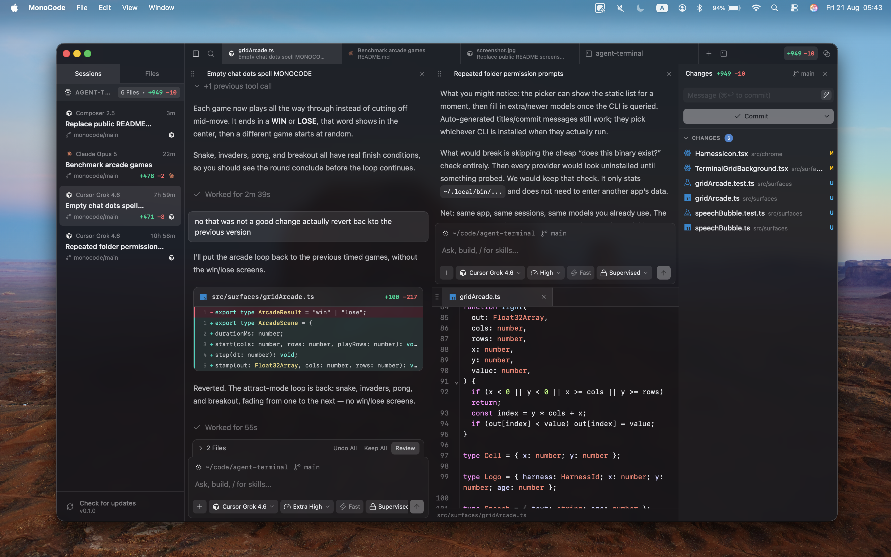

<p align="center">
  
</p>

<h1 align="center">wavex</h1>

<p align="center">
  <strong>A desktop UI for your coding agents.</strong>
</p>

<p align="center">
  
</p>

wavex runs installed coding-agent CLIs through the subscriptions you already have. It does not sell tokens. Supported providers include Claude Code, Codex, Cursor, Grok Build, OpenCode, Pi, omp, and fx.

## Prerequisites

Install and log in to at least one provider first:

- [Claude Code](https://claude.com/product/claude-code) — `claude auth login`
- [Codex](https://developers.openai.com/codex/cli) — `codex login`
- [Cursor CLI](https://cursor.com/cli) — `agent login`
- [Grok Build](https://docs.x.ai/build/overview) — `curl -fsSL https://x.ai/cli/install.sh | bash`, then `grok login`
- [OpenCode](https://opencode.ai) — `opencode auth login`
- [Pi](https://pi.dev/) — `pnpm add -g @earendil-works/pi-coding-agent`
- [omp](https://omp.sh) — `curl -fsSL https://omp.sh/install | sh`
- [fx](https://fx.sh) — `curl -fsSL https://fx.sh/setup.sh | bash`, then `fx login`

## Installation

wavex currently supports macOS on Apple Silicon. Download the `.dmg` from [GitHub Releases](https://github.com/lucabmn/wavex/releases/latest), open it, and drag wavex to Applications.

The release is not notarized. If Gatekeeper blocks the first launch, use **Open** from the context menu in Finder, or remove the quarantine attribute:

```sh
xattr -d com.apple.quarantine /Applications/wavex.app
```

## Build from source

Requirements: Node.js 22+, pnpm, Rust stable, and Xcode Command Line Tools.

```sh
pnpm install
pnpm tauri dev
```

## Project structure

| Directory          | Purpose                                  |
| ------------------ | ---------------------------------------- |
| `src/lib/`         | Domain and application logic             |
| `src/lib/harness/` | Provider adapters and wire protocols     |
| `src/chrome/`      | Application chrome and reusable controls |
| `src/surfaces/`    | Main views and editor surfaces           |
| `src/hooks/`       | React hooks                              |
| `src-tauri/src/`   | macOS desktop backend                    |
| `tests/unit/`      | TypeScript unit logic tests              |

## Development

```sh
pnpm check
pnpm test
pnpm format
```

A lefthook pre-commit hook runs oxlint, oxfmt, and rustfmt on staged files.

## Contributing

See [CONTRIBUTING.md](CONTRIBUTING.md). Small, focused pull requests are welcome.

## License

wavex is released under the [MIT License](LICENSE). Provider names and logos are trademarks of their respective owners; see [NOTICE](NOTICE).
